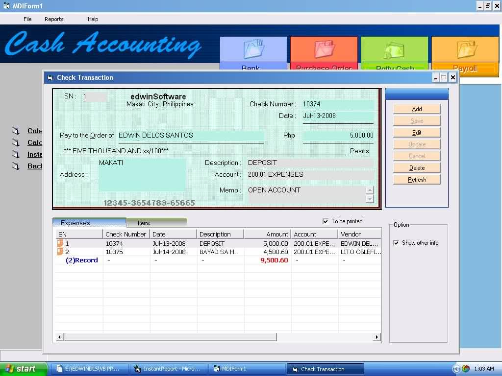



## Cash Accounting

### Description

updated 7/22/2008 CASH ACCOUNTING, UNFINISHED PROJECT USING ADO, BUT YOU CAN LEARN A LOT WITH IT ... ACTIVEx NOT INCLUDED, XTAB AND MY ACTIVEX CONTROL MAY BE DOWNLOADED HERE AT PSC ...
 
### More Info
 

             |
---                |---
**Submitted On**   |2008-07-21 22:27:38
**By**             |[EDWIN O\. DELOS SANTOS](https://github.com/Planet-Source-Code/PSCIndex/blob/master/ByAuthor/edwin-o-delos-santos.md)
**Level**          |Intermediate
**User Rating**    |4.7 (28 globes from 6 users)
**Compatibility**  |VB 6\.0
**Category**       |[Databases/ Data Access/ DAO/ ADO](https://github.com/Planet-Source-Code/PSCIndex/blob/master/ByCategory/databases-data-access-dao-ado__1-6.md)
**World**          |[Visual Basic](https://github.com/Planet-Source-Code/PSCIndex/blob/master/ByWorld/visual-basic.md)
**Archive File**   |[Cash\_Accou2121397222008\.zip](https://github.com/Planet-Source-Code/edwin-o-delos-santos-cash-accounting__1-70820/archive/master.zip)

